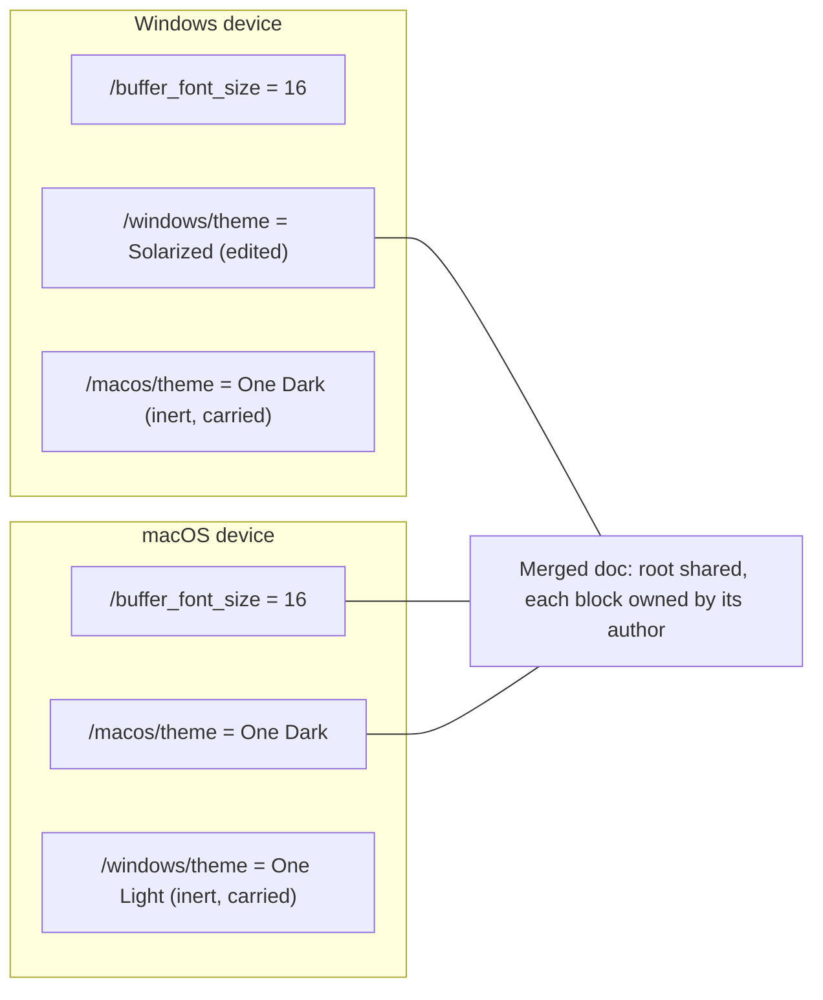
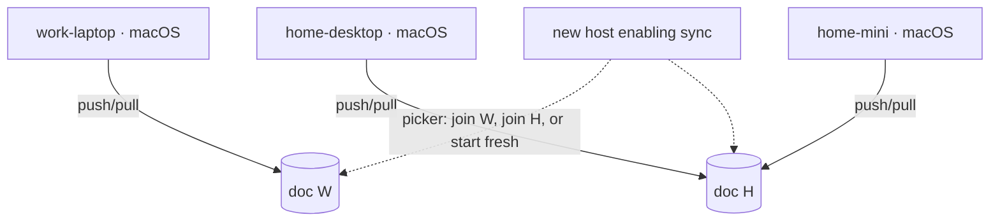
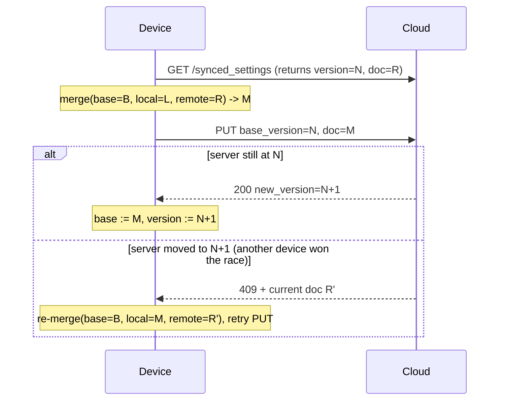
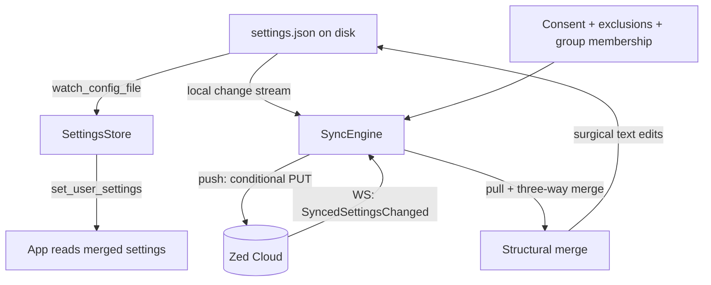
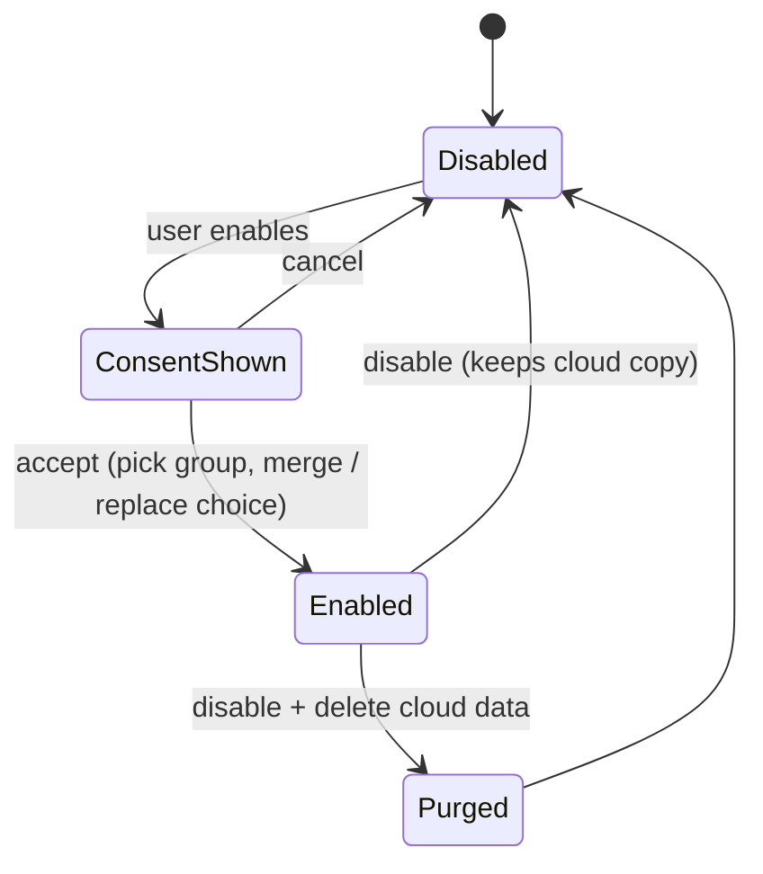

# Settings Sync

> What are we building?
>

Opt-in sync of `settings.json` (later extensions list, `tasks.json`, `keymap.json`, agent rules files and whatnot) across a signed-in user's machines via Zed Cloud. Sign-in and transport already exist (`Client`, `CloudApiClient`); the real work is a structure-aware, conflict-tolerant merge of a JSONC document.

> Why is byte-level sync wrong?
>

The file is a tree of scoped schemas, not a flat bag (`crates/settings_content/src/settings_content.rs`):

```jsonc
{
  "buffer_font_size": 15,          // everywhere
  "macos":   { "buffer_font_size": 16 },
  "windows": { "buffer_font_size": 14 },
  "preview": { "telemetry": { "metrics": false } },
  "profiles": { "Presenting": { "settings": { "buffer_font_size": 22 } } }
}
```

`SettingsStore::recompute_values` merges root → release-channel block → OS block; `for_os()` picks by `env::consts::OS`. **Every machine carries all override blocks but only reads its own.** A byte-level last-write-wins clobbers the inert blocks the other machines own. Also: comments and formatting must survive a round-trip, and machine-specific keys (audio devices, ssh connections, proxy) must never leave the device.

> Unit of sync?
>

Not the file — a map from JSON path to leaf value, derived from the JSONC document:

```
/buffer_font_size                 -> 15
/macos/buffer_font_size           -> 16
/windows/buffer_font_size         -> 14
/languages/Rust/tab_size          -> 4
/profiles/Presenting/settings/buffer_font_size -> 22
```

The path is the merge key, so `/buffer_font_size` and `/macos/buffer_font_size` never collide and the override blocks need no special-casing: a macOS device carries `/windows/*` verbatim and re-uploads it untouched. Comments/formatting are a local concern, preserved on apply (§ applying), never synced.

Leaves are scalars, arrays, and atomic objects; we descend into containers whose keys are user data (`languages`, `lsp`, `profiles`, the override blocks). Classification is derived from the generated JSON schema (`additionalProperties`-style maps are containers). 



> Two devices, same OS — platform blocks can't diverge them. Now what?
>

Sync groups, keyed by source host. Every push and pull carries the device's host identity — the same unit we already use for worktree trust (`RemoteHostLocation` in `crates/project/src/trusted_worktrees.rs`) — and the cloud keeps **one document per group of hosts**, not one per account:

```
account
├── group "work" : { work-laptop }             -> doc W (version 12)
└── group "home" : { home-desktop, home-mini } -> doc H (version 7)
```

Enabling sync on a new host opens a picker built from the hosts the cloud already knows: "Sync with work-laptop", "Sync with home-desktop + home-mini", or "Start independent". Joining a group runs the first-enable choice — **Merge / Replace local / Replace remote**, with a preview diff — against that group's doc; from then on the host shares it, and everything above — path merge, three-way, CAS — applies unchanged *within* the group. So `work-laptop` (macOS) and `home-desktop` (macOS) can have totally different settings: divergence is by group, not by override block, and platform blocks keep doing exactly one job — OS divergence within a group.



Identity: the hostname is the user-facing label, but the key is a device id minted at first enable and kept in sync state — hostnames collide and get renamed, ids don't. Rename is a label update in the status UI; nothing moves. A group of one is the degenerate case (private backup). Moving a host between groups re-runs the first-enable choice against the target group's doc.

> Conflicts: why three-way, and what's the base?
>

Two-way can't tell who changed what. Three-way adds the last agreed state `B`, so per leaf we know whether local `L` and/or remote `R` diverged from it:

| local vs base | remote vs base | result |
|---|---|---|
| unchanged | unchanged | no-op |
| changed | unchanged | **local** |
| unchanged | changed | **remote** |
| both changed, same value | | that value |
| both changed, differently | | **conflict** |
| deleted | unchanged (or both) | delete |
| changed | deleted (or vice-versa) | **conflict** |

The base (doc + server `version`) is persisted outside `settings.json`, git-ignored, disposable: if unreadable, degrade to two-way (remote as base) and notify. 

Conflict policy: last-writer-wins by **server-assigned** commit time (no client clocks), never silent — the loser is surfaced as a dismissible notification with a one-click revert ("kept 16, was 15 here — [Use 15]") and logged locally.

> How do racing devices not lose data?
>

Conditional PUT — compare-and-swap on the group doc's server version:



The loser re-merges against the newer doc and retries; bounded retries with backoff, then pause + notify. Assumed cloud surface (out of scope here, listed so the client is well-typed; a server-side kill switch is assumed too); all doc endpoints are scoped to the calling device's group:

| Endpoint | Purpose |
|---|---|
| `GET /client/synced_settings` | group doc + version |
| `PUT /client/synced_settings` | conditional write (`409` + current doc on version mismatch) |
| `GET /client/synced_settings/hosts` | known hosts: device id, label, group, last sync — feeds the join picker and status UI |
| `GET /client/synced_settings/history` | last N revisions of the group doc |
| `DELETE /client/synced_settings` | erase the group's cloud copy (`?all` erases the account's) |
| `MessageToClient::SyncedSettingsChanged` | WS push, carries group id: pull now if it's ours |

> Overall shape?
>



`SyncEngine` is one foreground GPUI entity in a new `settings_sync` crate: watches the file (debounced), listens to the websocket, owns the base and the device identity/group, merges, applies.

> How are remote changes applied without destroying my comments?
>

Merge output is `(json_path, new_value | delete)` ops applied to the current on-disk text via `settings_json::update_value_in_json_text` — the same surgical-edit primitive UI writes use (`edits_for_update` in `crates/settings/src/settings_store.rs`). Comments, key order, indentation survive; only changed paths are touched; write goes through `fs.atomic_write` and the normal `watch_config_file` reload — no second source of truth. Engine-originated writes are hash-tagged so the local-change handler skips the echo.

> Exclusions?
>

```jsonc
{
  "settings_sync": {
    "exclude": [
      "/experimental.input_audio_device",
      "/ssh_connections",
      "/proxy",
      "/macos/buffer_font_size"    // any subtree
    ]
  }
}
```

Path = node + its subtree. Excluded paths are stripped from `L`, `R`, and uploads; local values untouched. A default set ships built-in (hardware/network keys: audio devices, `ssh_connections`/`wsl_connections`/`dev_container_connections`, proxy). Long term, prefer marking fields machine-scoped in the schema (`#[machine_scope]`, VSCode-style) over growing the hand list — the denylist derives from the schema. The `exclude` list syncs like everything else within the group; `enabled` is device-local-authoritative.

Exclusions are strictly "never upload". "Differs per machine" is served by putting the machines in different groups — not by exclusions, and not by per-host override blocks.

> Consent and privacy?
>

Off by default. Enabling opens a consent dialog: what is uploaded (config docs minus exclusions), where (Zed Cloud, your account), that settings may contain values you consider sensitive, that keychain secrets are never synced, links to policy. Cancel is equal weight.



Status surface shows last sync, cloud version, hosts per group (labels), effective exclusions, history with restore. `DELETE` must be honored server-side (GDPR erasure). No telemetry piggybacks on the sync channel.

Security: existing HTTPS/WSS auth; server-side encryption at rest, account-scoped; real secrets live in the keychain (`CredentialsProvider`), not `settings.json` — audit `SettingsContent` for token/key/password-shaped fields before GA and machine-scope any offenders. E2E encryption is attractive but complicates key distribution; open question, not v1.

> Phasing?
>

| Phase | Documents | Notes |
|---|---|---|
| 1 | `settings.json` | Exercises the whole engine |
| 2 | `tasks.json` | Same path merge |
| 3 | `keymap.json` | Arrays, not maps — see below |
| later | extensions, themes | Needs installed-set manifest; separate RFC |

Keymap: top-level array of `KeymapSection` (`crates/settings/src/keymap_file.rs`), no stable key. Plan: key sections by content hash of `(context, use_key_equivalents)`, merge `bindings` maps within matching sections, union the rest. The v1 merge core therefore takes a **pluggable keying strategy** per document type.

> Schema additions?
>

```rust
#[with_fallible_options]
#[derive(Clone, PartialEq, Default, Serialize, Deserialize, JsonSchema, MergeFrom, Debug)]
pub struct SettingsSyncContent {
    /// Whether settings sync is enabled on this device. Device-local.
    pub enabled: Option<bool>,
    /// JSON paths (subtrees) to never upload. Merged with built-in defaults.
    pub exclude: Option<Vec<String>>,
}
```

Deliberately no host-override block and no change to `recompute_values` precedence — it stays root → channel → OS. Device id and group membership are sync state (persisted next to the base), not settings: they must not sync themselves, and must survive a settings reset.

> Forward compatibility?
>

Old clients carry unknown paths verbatim (we already tolerate unknown keys via `fallible_options`), so new keys survive an old client's write. The cloud doc carries a `schema_epoch`; below-epoch clients sync read-only and prompt to update.

> Edge cases?
>

| Case | Handling |
|---|---|
| Offline / signed out | Idle; pending push flushed on reconnect; base unchanged until a successful CAS |
| Hand-edit during apply | `atomic_write` + echo hash; if the file moved under us, re-read and re-merge |
| Malformed local JSON | Skip the cycle, warn; never upload garbage, never overwrite what we can't parse |
| Huge document | Server size cap (~1 MB); over cap → notify and refuse, don't truncate |
| CAS livelock | Bounded retries, then pause + notify |
| Clock skew | LWW uses server commit time |
| Path un-excluded | Next sync uploads it as a normal local change; no retroactive history |
| Two devices join a group with different files | No base ⇒ two-way; union disjoint paths, LWW + notify on true conflicts, **mandatory preview diff** (first-enable choice) |
| Hostname collision (two machines, same name) | Distinct device ids, colliding labels; status UI shows both and offers a relabel |
| Hostname changed | Label update; identity is the device id, group membership unaffected |
| Host moves between groups | Re-runs the first-enable choice (merge / replace, preview diff) against the target group's doc |
| Bad sync lands anyway | Local pre-apply snapshots + server history restore |

> Rollout?
>

1. `settings_sync` crate, merge core only — pure, no network, no GPUI. Property tests: convergent under CAS retry, never drops a non-conflicting edit, idempotent when idle.
2. Engine entity (watch → merge → surgical write) behind a feature flag; internal dogfood.
3. Consent + first-enable group picker + preview + secret-field audit.
4. GA `settings.json`; then `tasks.json`, then `keymap.json`.

Tests alongside: round-trip preserves comments/order; platform-block independence; simulated two-device CAS race converges losslessly; excluded subtrees absent from payloads; group scoping — a push never lands in, and a pull never reads from, another group's doc.

> Post-1.0?
>

Deliberately out of v1, in rough priority order: per-category toggles (UI / keymap / code style) as a friendlier facade over path sets — categories in the UI, paths stay the engine primitive; extension sync with silent install (needs an installed-set manifest; separate RFC); opt-in "ask me" conflict resolution on top of LWW; E2E encryption once key distribution is settled; richer history — per-host attribution and point-in-time restore beyond the plain revision list.

> Open questions
>

1. LWW + notification, or opt-in "ask me" now?
2. E2E encryption vs server-side encryption + account scoping?
3. Device id + group membership live in sync state, not `settings.json` — confirm.
4. Sync base location: config vs data dir.
5. Container/leaf classification purely from generated schema?
6. Observer mode for below-epoch clients, or hard gate?
7. Keymap keying details — settle before Phase 3.
8. Host display identity: hostname alone, or `user@hostname` (matching `RemoteHostLocation`)? The device id underneath makes this purely cosmetic.

> Worked example
>

Group "home" = { macbook, windows-tower, linux-box }, doc at version N. Base `B`: `/buffer_font_size=14`, `/macos/theme=One Dark`, `/windows/theme=One Light`.

- macbook sets `/buffer_font_size=16`; PUT at version N → N+1.
- windows-tower concurrently sets `/windows/theme=Solarized`; gets the WS ping, pulls N+1, merges (disjoint paths, no conflict), PUT base=N+1 → N+2.
- linux-box opens later, pulls N+2, applies both via surgical edits; the `macos`/`windows` blocks ride along inert.
- work-laptop is in group "work": it never sees N+1 or N+2, its doc W is untouched — same account, deliberately different settings.

No dialog, no clobber, comments intact, each block owned by its author, each group owned by its hosts.
